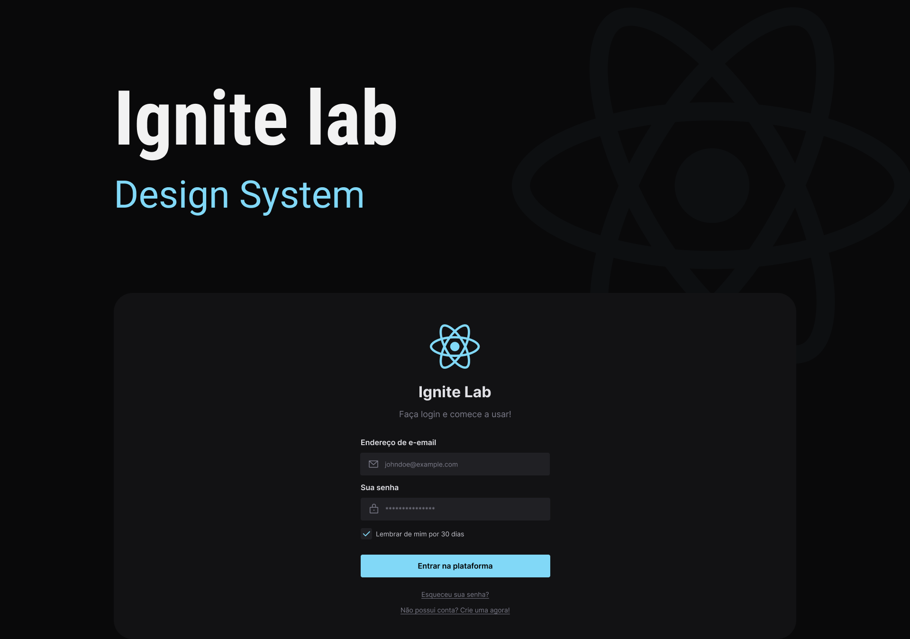
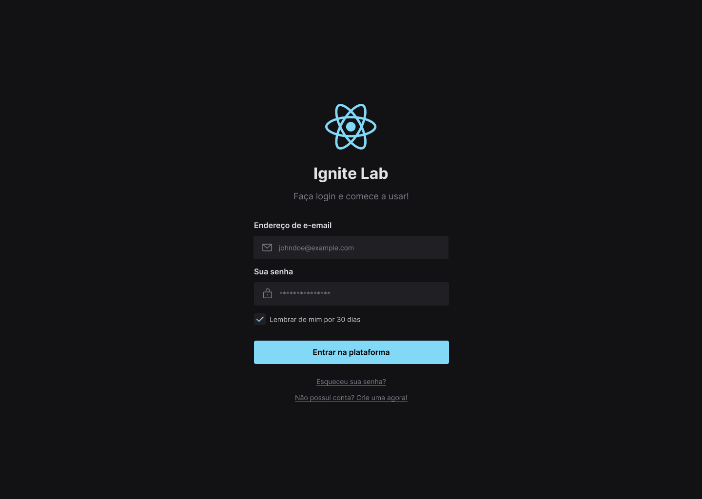
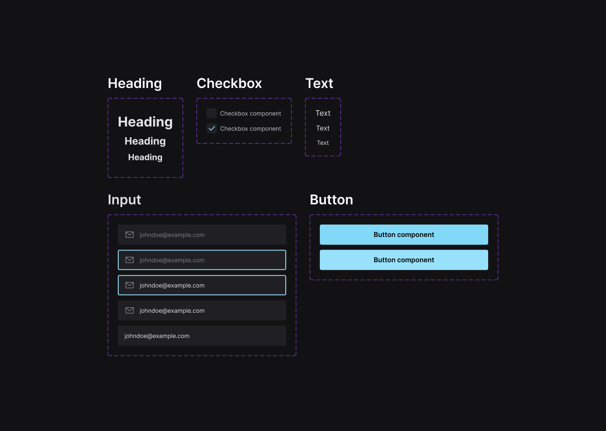

<h1 align="center" id="project_name">
  <br />
  
  <br />
</h1>

<p align="center">
Design System with Storybook.
</p>

<p align="center">
  <!-- GitHub last commit -->
  <a href="https://github.com/erik-albuquerque/lab-design-system/commits/main">
    
  </a>
  <!-- GitHub language count -->
  
  <!-- GitHub top language -->
  
  <!-- Repository size -->
  
  <!-- Repository status -->
  
  <!-- Link repo -->
  <a href="https://github.com/erik-albuquerque/lab-design-system/blob/main/LICENSE.md">
    
  </a>
</p>

<p align="center">
 <a href="#about">About</a> •
 <a href="#layout">Layout</a> • 
 <a href="#technologies">Technologies</a> • 
 <a href="#prerequisites">Prerequisites</a> •
 <a href="#demo">Demo</a> •
 <a href="#author">Autor</a> • 
 <a href="#license">License</a>
</p>

<p align="center">
  
</p>

<h4 align="center">
  	🚧 Lab Design System | Done 🚧
</h4>

<h2 id="about">
💻 About
</h2>

Lab Design System is a fictional design system built to apply the knowledge of [Storybook](https://storybook.js.org/), [Tailwindcss](https://tailwindcss.com/) and [React](https://reactjs.org/).

Project developed during the event Ignite Lab of [Rocketseat](https://www.rocketseat.com.br/).

<h2 id="layout">🎨 Layout</h2>
<a href="https://www.figma.com/file/dW2yBl9Fu1OrkNYxu6rgbl/Lab-Design-System?node-id=0%3A1">
  
</a>
<p align="center" style="display: flex; align-items: flex-start; justify-content: center; flex-direction: column; gap: 16px;">
  

  
</p>

<br />
<h2 id="technologies">🛠 Technologies</h2>

The following tools were used in the construction of the project:

- **[React](https://reactjs.org/)**
- **[TypeScript](https://www.typescriptlang.org/)**
- **[Tailwind](https://tailwindcss.com/)**
- **[Radix UI](https://www.radix-ui.com/)**
- **[Storybook](https://storybook.js.org/)**
- **[Vite](https://vitejs.dev/)**

> See more [package.json](package.json)

**Utilities**

- API: **[Axios](https://axios-http.com/docs/intro)**
- IDE: **[Visual Studio Code](https://code.visualstudio.com/)**
- Icons: **[React Icons](https://phosphoricons.com/)**
- Fonts: **[Inter](https://fonts.google.com/specimen/Inter)**

<h2 id="prerequisites">💿 How to run the project</h2>

### 🧰 Prerequisites

Before you start, you will need to have the following tools installed on your machine:

> [Git](https://git-scm.com), [Node.js](https://nodejs.org/en/) or [Yarn](https://yarnpkg.com/) if you prefer.
> In addition it is good to have an editor to work with the code as [VSCode](https://code.visualstudio.com/)

### 🧭 Running the Project

```bash
# Clone repo
$ git clone https://github.com/erik-albuquerque/lab-design-system.git

# Access the project folder in the terminal/cmd
$ cd lab-design-system

# Install the dependencies (npm or yarn)
$ yarn

# Run the application in development mode
$ yarn dev

# see on http://127.0.0.1:5173/
# If you want to see the components in Storybook: 
$ yarn storybook

```

<h2 id="demo">🧪 Demo</h2>
<a href="http://localhost:3000">
<!-- Link externo ou local(.github). -->
    
</a>
<a style="margin-left: 16px" href="https://erik-albuquerque.github.io/lab-design-system/">
<!-- Link externo ou local(.github). -->
    
</a>

<h2 id="author">🦸 Autor</h2>
<a href="https://github.com/erik-albuquerque">
 
 <br />
 <sub><b>Érik Albuquerque</b></sub></a>

[](https://www.linkedin.com/in/erik-albuquerque/)
[](mailto:erik.albuquerque.oficial@gmail.com)

<h2 id="license">📝 License</h2>

Distributed under MIT license. See [LICENSE](LICENSE) for more information.

Made with ❤️ by Érik Albuquerque 👋🏽 [Contact!](https://www.linkedin.com/in/erik-albuquerque/)

[⬆ Back to top](#project_name)<br />